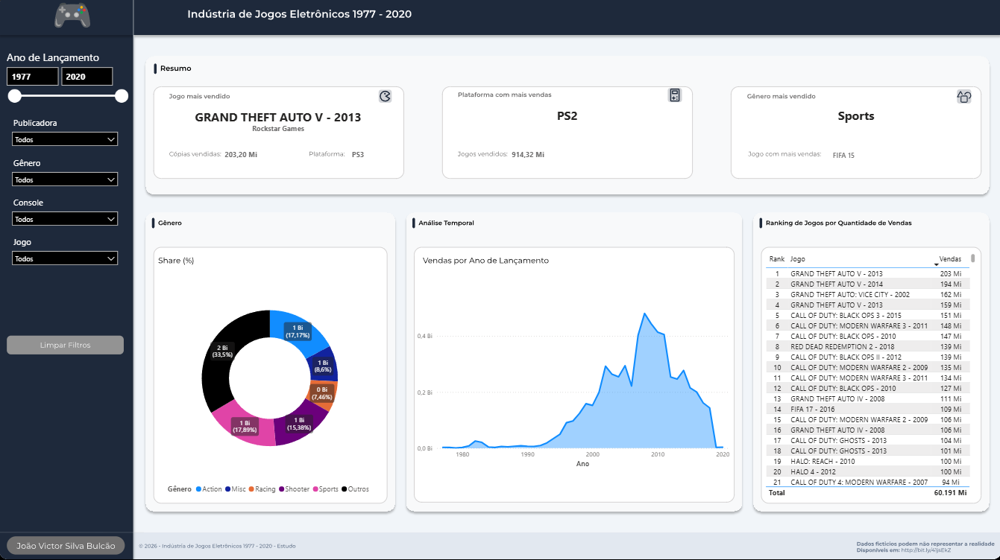

# 📊 Dashboard: Indústria de Jogos Eletrônicos (1977-2020)

## 📝 Visão Geral do Projeto
Este projeto apresenta um dashboard interativo desenvolvido em **Power BI** para analisar o panorama histórico de vendas da indústria de jogos eletrônicos entre os anos de 1977 e 2020. O objetivo principal é extrair *insights* sobre o mercado global, identificando padrões de consumo, a evolução da popularidade das plataformas (consoles) e as tendências dos gêneros de maior sucesso ao longo das décadas.

## 📈 Principais Métricas e KPIs Acompanhados

O relatório foi construído para responder rapidamente a perguntas de negócios através dos seguintes indicadores:

- **Jogo de Maior Sucesso:** Identifica o título com o maior volume de vendas brutas no período filtrado, detalhando seu ano de lançamento, publicadora e plataforma de destaque.
- **Plataforma Dominante:** Destaca o console com a maior saída de jogos, apresentando o volume total de unidades vendidas para aquele ecossistema.
- **Gênero Favorito:** Aponta o gênero mais consumido pelo público, indicando qual foi o jogo "carro-chefe" responsável por impulsionar essa categoria.
- **Market Share por Gênero (Share %):** Gráfico de rosca que ilustra a distribuição percentual das vendas, facilitando a visualização da fatia de mercado de cada estilo de jogo.
- **Evolução Temporal das Vendas:** Gráfico de área que mapeia o volume de vendas ano a ano, permitindo a fácil identificação de picos históricos e o aquecimento da indústria de games.
- **Ranking Geral (Top Games):** Tabela classificatória detalhando a posição de cada jogo por quantidade de unidades vendidas em milhões.

## 📷 Screenshots / Demonstração
### 1. Visão Geral (Overview)

## 🛠️ Tecnologias e Ferramentas Utilizadas
- **Power BI:** Desenvolvimento do relatório interativo, visualização de dados e publicação.
- **Linguagem DAX:** Criação de medidas, colunas calculadas e funções de inteligência de tempo (*Time Intelligence*) para análises dinâmicas.
- **Power Query (Linguagem M):** Construção do processo de ETL (Extração, Transformação e Carga) para limpeza e preparação dos dados brutos.
- **Figma:** Prototipação e design de interface (UI/UX), criação de *backgrounds* customizados para garantir um layout profissional e focado na usabilidade.

## 📑 Estrutura de Dados e Modelagem
A modelagem de dados foi estruturada utilizando o **Star Schema (Esquema Estrela)**, garantindo a otimização de performance do relatório e facilitando a propagação dos filtros.
- **Tabela Fato:** `fGameSales` (Armazena as métricas quantitativas de vendas).
- **Tabelas Dimensão:** `dConsole`, `dDatas`, `dDeveloper`, `dGenre`, `dPublisher` e `dTitle` (Fornecem os contextos para os filtros e eixos dos gráficos).

## 🚀 Como Executar este Projeto Localmente

Para abrir e interagir com o arquivo original na sua máquina:
1. Faça o clone deste repositório ou baixe o arquivo `.zip`.
2. Certifique-se de que possui o [Power BI Desktop](https://powerbi.microsoft.com/desktop/) instalado.
3. Abra o arquivo `Dashboard_Industria_Jogos.pbix`.
4. *(Opcional)* Caso deseje atualizar os dados, será necessário acessar o **Power Query** e alterar o parâmetro de caminho da pasta/fonte de dados para o diretório correto no seu computador.